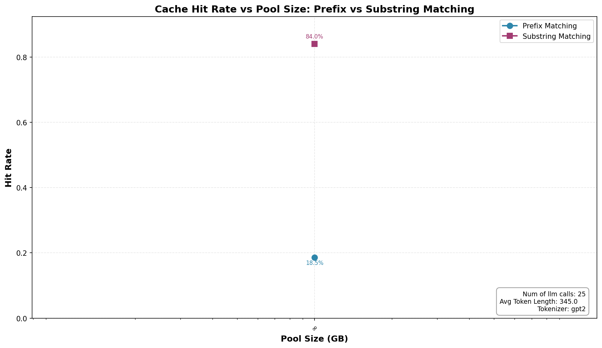

# PyCodeAGI

## Overview

[PyCodeAGI](https://github.com/chakkaradeep/pyCodeAGI) is a minimal AGI experiment inspired by BabyAGI and AutoGPT. Given a high-level app idea (e.g., "build a calculator app"), it autonomously generates a complete Python/Streamlit application through a sequential LLM pipeline.

This trace is based on the **GPT-4 version** (`pycodeagi-gpt4.py`), which uses a 5-step chat-format pipeline with `ChatOpenAI / gpt-4`.

> **Note**: The original `pycodeagi.py` targets `text-davinci-003` (deprecated Jan 2024). The GPT-4 version cannot be run without porting due to LangChain API changes (`v0.0.139 → v0.3+`). This trace reproduces the prompt templates from `pycodeagi-gpt4.py`; `generate_trace.py` serves as a reference for contributors who wish to generate a real trace once the code is ported.

---

## 💡 Background: Cache Types

We categorize KV cache reuse scenarios into two types:

* **Prefix Match**
    * Matches that are identical starting from the very beginning of the prompt (index 0). Even a single different token breaks the chain for all subsequent content.

* **Substring Match**
    * Repeated text blocks located in the middle or end of the prompt, where the preceding content has changed.

---

## 🔍 Agent Architecture

PyCodeAGI uses a fixed, deterministic 5-step pipeline:

| Step | Task | Approx. Input Tokens¹ |
|------|------|---------------------|
| 1 | Generate app description | ~80 |
| 2 | Design architecture | ~250 |
| 3 | Design UX flow | ~600 |
| 4 | Design code flow | ~1,200 |
| 5 | Generate app code | ~2,000 |

> ¹ Token counts approximate a real GPT-4 run with full-length outputs. The synthetic `trace.jsonl` uses compact representative outputs (~70–380 tokens per input) to keep the trace lightweight.

Each step's system message carries a **growing context block**: the accumulated outputs of all prior steps. However, each step also changes its introductory instruction line (e.g., `"You are given the app name and description."` → `"You are given the app name, description and architecture."`), which means consecutive steps do **not** form a strict prefix chain.

### Prompt Structure

```
[System]
You are code generation AI proficient in Python and Streamlit...
<step-specific intro line>    ← changes every step (breaks prefix chain)
App Name: <objective>
Description: <step1_output>   ← accumulated (substring match opportunity)
Architecture: <step2_output>  ← accumulated (substring match opportunity)
...

[User]
<current step task>
```

---

## 🔬 Why Prefix Cache Fails

Between every pair of consecutive steps, the intro line changes:

| Transition | Intro line diverges at... |
|------------|--------------------------|
| Step 1 → 2 | char ~213: `"Users will interact…"` vs `"You are given the app name and description."` |
| Step 2 → 3 | `"…and description."` vs `"…description and architecture."` |
| Step 3 → 4 | `"…and architecture."` vs `"…architecture and UX flow."` |
| Step 4 → 5 | `"…and UX flow."` vs `"…UX flow and code flow."` |

The comma-insertion pattern (`A and B` → `A, B and C`) changes the token sequence at ~40 tokens into the system message — **no two consecutive steps share a prefix beyond the static 4-line header**.

---

## 📊 Cache Reuse Analysis

### Within-session pattern

Each step's system block accumulates prior outputs as **non-prefix substrings**. The changing intro line breaks prefix continuity at ~40 tokens, but the bulk of each step's input (the accumulated outputs) appears verbatim as substrings in all subsequent steps.

**PyCodeAGI is a strong case for substring caching (CacheBlend), not prefix caching.**

### Cross-session pattern

All sessions share the same static ~40-token header before diverging at the objective-specific content. This shared boilerplate contributes a modest cross-session prefix hit.

---

## 📈 Case Analysis

Analysis results from running `prefix_analysis.py` on 5 sessions × 5 steps = 25 entries:

| Cache Type | Hit Rate |
|------------|----------|
| Prefix Match | **18.55%** |
| Substring Match | **84.03%** |

<div align=center>

</div>

**Observations:**

* **Low prefix hit rate (18.55%)**: Comes primarily from cross-session template boilerplate sharing (the ~40-token static header). No within-session prefix chain exists because the intro line changes at every step.

* **High substring hit rate (84.03%)**: The accumulated outputs (description, architecture, UX flow, code flow) appear as exact substrings in all subsequent steps' system messages, yielding strong substring reuse throughout each session.

* **Practical implication**: PyCodeAGI benefits significantly from CacheBlend-style substring matching, but only modestly from pure GPU prefix caching. LMCache CPU offload with substring matching would provide the greatest TTFT reduction for this workload.

---

## Trace Details

- **Sessions**: 5 (different app objectives)
- **LLM calls per session**: 5
- **Total trace entries**: 25
- **Model**: GPT-4 (chat format, `ChatOpenAI`)
- **Timestamps**: absolute Unix microseconds (int64)
- **Session IDs**: MD5 hex digest of the app objective string
- **Synthetic disclosure**: Inputs reproduce prompt templates adapted from `pycodeagi-gpt4.py`; outputs are hand-crafted representative examples.

## Reproduce the Trace

```bash
python generate_trace.py
```

No API keys or external dependencies required.

## Run Cache Analysis

```bash
cd ..
# Use --tokenizer gpt2 to avoid requiring a HuggingFace auth token
python prefix_analysis.py -i pyCodeAGI/trace.jsonl -o pyCodeAGI/pycodeagi_hit_rate.png --tokenizer gpt2
```
